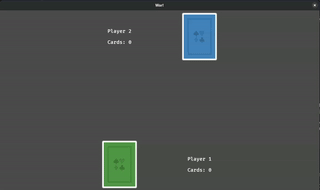

# War Card Game Simulator



The card game War built in Bevy, press space to move forward through draw and battle phases of a round and shift to fast forward.

## About the repo

The following was the best way to setup bevy on my Linux Fedora OS at the time of writing.

Features:

(All quotes in this section are from [the bevy doc's here](https://bevyengine.org/learn/quick-start/getting-started/setup/#enable-fast-compiles-optional))

## dynamic linking

Does not use dynamic linking as we use `mold` and as noted in the docs:

> Disabling bevy/dynamic_linking may improve Mold's performance. [citation needed]

## Mold

We use Mold instead of the other alternative as a Rust linker `lld` since it's 5x faster than `lld`. The default linker for Rust at the time of writing this is `cc` which is slower than `lld`.

> Mold is up to 5× (five times!) faster than LLD [an alternative linker], but with a few caveats like limited platform support and occasional stability issues. To install mold, find your OS below and run the given command:
> Ubuntu: `sudo apt-get install mold clang`
> Fedora: `sudo dnf install mold clang`
> Arch: `sudo pacman -S mold clang`

## Nightly Rust Compiler

Don't forget to install your nightly rust version using rustup which on linux the command would be:

```bash
rustup install nightly-x86_64-unknown-linux-gnu
```

## Cranelift

> This gives access to the latest performance improvements and "unstable" optimizations, including generic sharing below.  
> This uses a new nightly-only codegen that is about 30% faster at compiling than LLVM. It currently works best on Linux.  
> To install cranelift, run the following.

```bash
rustup component add rustc-codegen-cranelift-preview --toolchain nightly
```

> While cranelift is very fast to compile, the generated binaries are not optimized for speed. Additionally, it is generally still immature, so you may run into issues with it. Notably, Wasm builds do not work yet.
> When shipping your game, you should still compile it with LLVM.

## Generic Sharing

> Allows crates to share monomorphized generic code instead of duplicating it. In some cases this allows us to "precompile" generic code so it doesn't affect iterative compiles. This is currently only available on nightly Rust (see above).

```toml
# /path/to/project/.cargo/config.toml
[target.x86_64-unknown-linux-gnu]
rustflags = [
  # (Nightly) Make the current crate share its generic instantiations
  "-Zshare-generics=y",
]
```

## Improve Runtime Performance

> Bevy's dependencies do a lot of trace logging that is not relevant for an end user. To improve your runtime performance, you can add the following to the [dependencies] section of your Cargo.toml. It will disable detailed log levels on compile time so that they do not need to be filtered out while your app is running.

```toml
log = { version = "*", features = ["max_level_debug", "release_max_level_warn"] }
```
